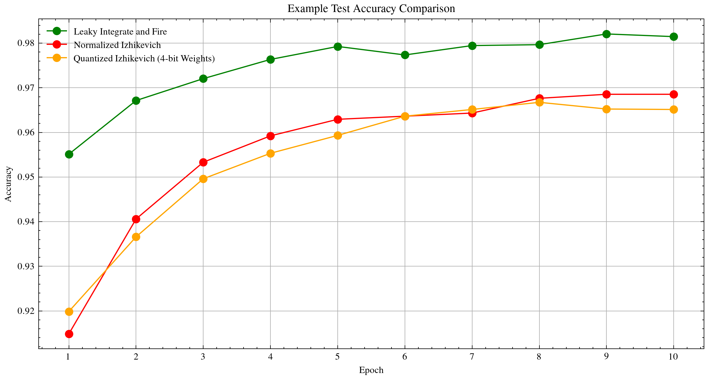

# Overview
This repository summarizes work done during the 2024 Summer of Code at ISY/DA. The main goal of the project has been to explore backpropagation and gradient descent for training spiking neural networks (SNNs) based on the Izhikevich neuron model. It builds upon several works, including:

1. *Energy Proportional Streaming SNN in a Reconfigurable System*[^1]: Focuses on the implementation of energy-efficient SNNs on FPGAs.
2. *Evolutionary FPGA-Based Spiking Neural Networks for Continual Learning*[^2]: Explores the use of evolutionary algorithms for optimizing FPGA-based SNNs for continual learning applications.
3. *A High-Level Interface for Accelerating SNNs*[^3]: Describes an interface for rapidly prototyping SNN training algorithms and topologies on FPGAs.

With a platform in place to implement SNNs and training algorithms, this project sought to evaluate the potential of using backpropagation instead of the evolutionary strategies previously used. A first step in this direction is defining a neuron and network model in software. The chosen solution was to build upon [snnTorch](https://github.com/jeshraghian/snntorch/), a PyTorch based library for SNNs providing many useful features like surrogate gradient definitions, spike encoding algorithms, and existing models to benchmark against.

Both the standard Izhikevich model with biologically plausible parameter values and a normalized model presented in Liu et al.[^4] were examined and compared with the Leaky Integrate and Fire (LIF) model as a hypothesis was held that the Izhikevich model's compromise between computational simplicity and behavioural complexity could yield an advantage over LIF. Furthermore, as the interconnecting layers between neurons had been represented by a synaptic model in the previous works, this was implemented in software as well as a simpler linear layer for comparison.

# Preliminary findings
1. The synaptic model layers resulted in worse optimization compared to simple linear layers.
2. The normalized model was handled better than the standard one by the optimizer and made integration with other PyTorch modules and functions simpler.
3. The normalized model enabled efficient learning of the MNIST dataset without much hyperparameter optimizations, indicating further potential.
4. Neither Izhikevich model was able to reach the performance of LIF on MNIST.

*Results from an example training session on MNIST during 10 epochs with a batch size of 256, learning rate of 5e-4, and rate coding of the input pixels to spikes. The network topology was three layers of 784, 512, and 10 neurons.*

# Ongoing and future work
Given that no benefit to using the Izhikevich model over LIF applied to MNIST but it still showed promise, further work could be done in various directions.

## Making more parameters learnable
One benefit of the Izhikevich model is the different spiking behaviours that can be achieved by choosing parameters *a*, *b*, *c*, and *d*. Making these learnable could be beneficial as it would allow more complex and varying firing patterns throughout a network.

## Exploring more complex datasets
Given the relative simplicity of MNIST, more complex and temporal datasets like N-MNIST, ST-MNIST or the Spiking Heidelberg Digits could be explored and potentially benefit more from the Izhikevich model's strengths.

## A PYNQ Overlay
Héctor Rordíguez has made changes to the FPGA IP used in [1] and [2] to implement the normalized Izhikevich model available at [https://github.com/des-cei/snn_izhikevich](https://github.com/des-cei/snn_izhikevich). Writing a PYNQ Overlay similar to the one in [3] supporting these changes would allow both training and inference to be run from a Jupyter notebook or Python script. With the use of a more powerful SoC like the AMD Xilinx Zynq UltraScale+ MPSoC ZU3EG on the Ultra96-V2 development board, this could enable continuous learning on the edge.

## Quantizing weights and states
By using the Xilinx Brevitas libraries, quantization aware training (QAT) can be implemented as seen in the example Jupyter notebook. Initial trials indicate that quantization of weights to 4 bits can be done with only a small effect on accuracy. This could be further investigated and compared with post-training quantization (PTQ). Neuron states can also be quantized by snnTorch, which also could prove useful.

# Getting started
To get started with continued testing and developing of the project, simply clone this repo and run ``pip install -r requirements.txt``. The notebook ``notebooks/training.ipynb`` serves as an example on how to use the new neuron type and explore different training strategies and network topologies for the MNSIT dataset. The [snnTorch documentation](https://snntorch.readthedocs.io/) provides great tutorials on the theory and implementation of SNNs with many more example notebooks to learn from.

With regard to hardware, the work has been mainly done on a CUDA-powered workstation but has been successfully run on the Avnet Ultra96-V2 development board. To replicate the setup:

1. Install PYNQ version 3.0.1 on the board.
2. Clone this repository.
3. Run ``pip install -r requirements.txt``
4. Launch a Jupyter Lab server to which one can connect remotely and run the notebook.

[^1]: Galindo Sanchez, Felipe, and Nunez-Yanez, Jose. "Energy proportional streaming spiking neural network in a reconfigurable system." *Microprocessors and Microsystems* 53 (2017): 57–67. [DOI:10.1016/j.micpro.2017.06.018](https://doi.org/10.1016/j.micpro.2017.06.018).

[^2]: Otero, Andrés, Sanllorente, Guillermo, de la Torre, Eduardo, and Nunez-Yanez, Jose. "Evolutionary FPGA-Based Spiking Neural Networks for Continual Learning." In *Applied Reconfigurable Computing. Architectures, Tools, and Applications*, edited by Palumbo, Francesca, Keramidas, Georgios, Voros, Nikolaos, and Diniz, Pedro C., 260–274. Lecture Notes in Computer Science. Cham: Springer Nature Switzerland, 2023. [DOI:10.1007/978-3-031-42921-7_18](https://doi.org/10.1007/978-3-031-42921-7_18).

[^3]: Eidlitz Rivera, Kaspar Oscarsson. *A High-Level Interface for Accelerating Spiking Neural Networks on the Edge with Heterogeneous Hardware: Enabling Rapid Prototyping of Training Algorithms and Topologies on Field-Programmable Gate Arrays*. Linköping University, Computer Engineering, 2024. [ISRN:LiTH-ISY-EX-ET--24/0528--SE](https://urn.kb.se/resolve?urn=urn:nbn:se:liu:diva-205504).

[^4]: Liu, Wei, Xiao, Shanlin, Li, Bo, and Yu, Zhiyi. "SC-IZ: A Low-Cost Biologically Plausible Izhikevich Neuron for Large-Scale Neuromorphic Systems Using Stochastic Computing." *Electronics* 13 (2024): 909. [DOI:10.3390/electronics13050909](https://doi.org/10.3390/electronics13050909).
